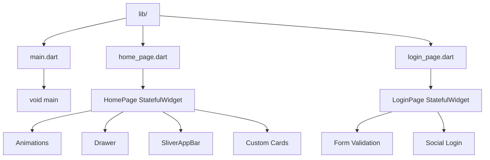

# 🎓 ARYAN Institute App - README

<div align="center">


### *Excellence in Education Since 2000*

[](https://flutter.dev)
[](https://dart.dev)
[](LICENSE)
[](http://makeapullrequest.com)


---

</div>

## ✨ *Features at a Glance*

<table align="center">
  <tr>
    <td align="center">🎨</td>
    <td align="center">📱</td>
    <td align="center">🔄</td>
    <td align="center">🎭</td>
  </tr>
  <tr>
    <td align="center"><b>Green & White Theme</b></td>
    <td align="center"><b>Responsive Design</b></td>
    <td align="center"><b>Smooth Animations</b></td>
    <td align="center"><b>Custom Drawer</b></td>
  </tr>
  <tr>
    <td align="center">🔐</td>
    <td align="center">📊</td>
    <td align="center">📝</td>
    <td align="center">🎯</td>
  </tr>
  <tr>
    <td align="center"><b>Login System</b></td>
    <td align="center"><b>Institute Stats</b></td>
    <td align="center"><b>Course Cards</b></td>
    <td align="center"><b>Testimonials</b></td>
  </tr>
</table>

---

## 📱 *App Preview*

<div align="center">
  
```dart
// Welcome to ARYAN Institute App
🌟 Home Page     ↔     🔐 Login Page     ↔     📋 Drawer Menu
```

### *Screen Mockup*
```
┌─────────────────────────────────┐
│  🟢🟢🟢  ARYAN Institute  🟢🟢🟢  │
├─────────────────────────────────┤
│  ┌───────────────────────────┐  │
│  │  🏫  Quality Education    │  │
│  │  Shape your future...     │  │
│  │  [Explore Courses] 🚀     │  │
│  └───────────────────────────┘  │
│                                  │
│  📊 Our Achievements             │
│  ┌──────┐  ┌──────┐  ┌──────┐  │
│  │5000+ │  │200+  │  │50+   │  │
│  │Students │Faculty │  │Awards│  │
│  └──────┘  └──────┘  └──────┘  │
│                                  │
│  📚 Popular Courses              │
│  ┌────┐ ┌────┐ ┌────┐ ┌────┐   │
│  │ CS │ │ EE │ │ ME │ │ CE │   │
│  └────┘ └────┘ └────┘ └────┘   │
└─────────────────────────────────┘
```

</div>

---

## 🚀 *Getting Started*

### 📋 *Prerequisites*

```bash
# Check your Flutter installation
flutter --version
# Should show Flutter 3.0+ and Dart 3.0+

# Ensure you have an emulator running or device connected
flutter devices
```

### ⚡ *Quick Setup*

<div align="left">

```bash
# 1️⃣ Clone the repository
git clone https://github.com/yourusername/aryan_institute_app.git

# 2️⃣ Navigate to project directory
cd aryan_institute_app

# 3️⃣ Get dependencies
flutter pub get

# 4️⃣ Run the app
flutter run

# 🎉 That's it! The app should now be running!
```

</div>

---

## 🏗️ *Project Structure*



---

## 🎨 *Theme & Design*

### 🟢 *Color Palette*

<div align="center">

| Color Name | Hex Code | Usage |
|------------|----------|-------|
| 🌿 Light Green | `#4CAF50` | Backgrounds, Icons |
| 🌲 Medium Green | `#2E7D32` | Headers, Buttons |
| 🌳 Dark Green | `#1B5E20` | Footer, Gradients |
| ⚪ White | `#FFFFFF` | Text on dark, Cards |
| 🔘 Light Grey | `#F5F5F5` | Background accents |

</div>

### ✨ *Animations*

<table>
  <tr>
    <th>Animation Type</th>
    <th>Duration</th>
    <th>Curve</th>
  </tr>
  <tr>
    <td>🎭 Fade In</td>
    <td>1000ms</td>
    <td>easeIn</td>
  </tr>
  <tr>
    <td>📤 Slide Up</td>
    <td>800ms</td>
    <td>easeOut</td>
  </tr>
</table>

---

## 📦 *Dependencies*

```yaml
dependencies:
  flutter:
    sdk: flutter
  
  # Material Design Icons (built-in)
  # Cupertino Icons (built-in)
  
dev_dependencies:
  flutter_test:
    sdk: flutter
  flutter_lints: ^2.0.0
```

---

## 🎯 *Core Features Deep Dive*

### 🏠 *Home Page*

<details>
<summary>📸 Click to expand features</summary>

- **🎨 Custom SliverAppBar** with expandable header
- **📊 Statistics Cards** showing institute achievements
- **📚 Horizontal Course Cards** for popular programs
- **💬 Student Testimonials** with ratings
- **📅 Upcoming Events** section
- **👣 Custom Drawer** with navigation options
- **🎭 Smooth Animations** throughout
- **🔍 Search & Notification** icons

</details>

### 🔐 *Login Page*

<details>
<summary>🔑 Click to expand features</summary>

- **✅ Form Validation** for email and password
- **👁️ Password visibility toggle**
- **🎨 Gradient icon container**
- **🔄 Social login options** (Google, Facebook, Apple)
- **📱 Responsive design**
- **✨ Entrance animations**
- **🔔 Custom snackbars**
- **📝 "Forgot Password"** functionality

</details>

---

## 🎬 *Animation Showcase*

```dart
// Fade Animation
_fadeAnimation = Tween<double>(
  begin: 0.0,
  end: 1.0,
).animate(CurvedAnimation(
  parent: _fadeController, 
  curve: Curves.easeIn
));

// Slide Animation
_slideAnimation = Tween<Offset>(
  begin: const Offset(0, 0.5),
  end: Offset.zero,
).animate(CurvedAnimation(
  parent: _slideController, 
  curve: Curves.easeOut
));
```

---

## 📱 *Responsive Design*

<div align="center">

| Device | Layout | Status |
|--------|--------|--------|
| 📱 Phone (360x640) | Single Column | ✅ Perfect |
| 📱 Phone (390x844) | Single Column | ✅ Perfect |
| 📱 Tablet (600x1024) | Dual Column | ✅ Adapts |
| 💻 Desktop (1920x1080) | Centered | ✅ Works |

</div>

---

## 🤝 *Contributing*

<div align="center">

### *We Love Contributors!* ❤️

</div>

1. 🍴 **Fork** the repository
2. 🌿 Create your feature branch: `git checkout -b feature/AmazingFeature`
3. 💾 Commit your changes: `git commit -m 'Add some AmazingFeature'`
4. 📤 Push to the branch: `git push origin feature/AmazingFeature`
5. 🔍 Open a **Pull Request**

---

## 📄 *License*

<div align="center">

```
MIT License

Copyright (c) 2024 ARYAN Institute of Engineering & Technology

Permission is hereby granted, free of charge, to any person obtaining a copy
of this software and associated documentation files...
```

</div>

---

## 👥 *Team*

<div align="center">

| Role | Name |
|------|------|
| 🎨 UI/UX Designer | [Your Name] |
| 💻 Lead Developer | [Your Name] |
| 🧪 Tester | [Your Name] |

</div>

---

## 🙏 *Acknowledgments*

<div align="center">

- 🎓 **ARYAN Institute** for inspiration
- 💙 **Flutter Team** for amazing framework
- 🌟 **All Contributors** who make this better

---

### *Made with ❤️ for Education*

**[⬆ back to top](#-aryan-institute-app---readme)**

</div>