# 🎓 ARYAN Institute App - README

<div align="center">


### *Excellence in Education Since 2009*

[](https://flutter.dev)
[](https://dart.dev)
[](https://firebase.google.com)
[](LICENSE)
[](http://makeapullrequest.com)

---

## ✨ Features at a Glance

<table align="center">
  <tr>
    <td align="center">🎨</td>
    <td align="center">📱</td>
    <td align="center">🔄</td>
    <td align="center">🎭</td>
  </tr>
  <tr>
    <td align="center"><b>Green & White Theme</b></td>
    <td align="center"><b>Responsive Design</b></td>
    <td align="center"><b>Smooth Animations</b></td>
    <td align="center"><b>Custom Drawer</b></td>
  </tr>
  <tr>
    <td align="center">🔐</td>
    <td align="center">📊</td>
    <td align="center">📝</td>
    <td align="center">🎯</td>
  </tr>
  <tr>
    <td align="center"><b>Firebase Auth</b></td>
    <td align="center"><b>Role-based Dashboards</b></td>
    <td align="center"><b>Assignments</b></td>
    <td align="center"><b>Student Dashboard</b></td>
  </tr>
  <tr>
    <td align="center">👨‍🏫</td>
    <td align="center">📚</td>
    <td align="center">📅</td>
    <td align="center">🔔</td>
  </tr>
  <tr>
    <td align="center"><b>Faculty Dashboard</b></td>
    <td align="center"><b>Courses Page</b></td>
    <td align="center"><b>Events Section</b></td>
    <td align="center"><b>Notices</b></td>
  </tr>
</table>

---

## 📱 App Preview

<div align="center">
  
```dart
// Welcome to ARYAN Institute App
🏠 Home Page → 🔐 Login → 🎓 Student/Faculty Dashboard
```

### Screen Flow
```
┌─────────────────────────────────┐
│  🟢🟢🟢  ARYAN Institute     🟢🟢🟢  │
│  Institute of Engineering &     │
│  Technology                    │
├─────────────────────────────────┤
│  🎯 Shape Your Future          │
│  [Explore Courses] [Login Now] │
│                                 │
│  📊 Stats: 5000+ Students     │
│           200+ Faculty         │
│           50+ Companies        │
│                                 │
│  📚 Popular Courses            │
│  ┌────┐ ┌────┐ ┌────┐ ┌────┐  │
│  │ CSE│ │ AI │ │ ECE│ │ ME │  │
│  └────┘ └────┘ └────┘ └────┘  │
│                                 │
│  📅 Upcoming Events            │
│  💬 Student Testimonials       │
└─────────────────────────────────┘
         ↓
┌─────────────────────────────────┐
│  🔐 Role Selection Login       │
│  👨‍🎓 Student | 👨‍🏫 Faculty    │
│  👷 Staff | 🏛️ Authority       │
└─────────────────────────────────┘
         ↓
┌─────────────────────────────────┐
│  🎓 Student Dashboard          │
│  Welcome, [Student Name]!      │
│  Branch: CSE | Year: 2nd       │
│                                 │
│  📝 Active Assignments         │
│  📢 Notices & Announcements    │
│  ⚡ Quick Actions              │
└─────────────────────────────────┘
```

</div>

---

## 🚀 Getting Started

### 📋 Prerequisites

```bash
# Check your Flutter installation
flutter --version
# Should show Flutter 3.0+ and Dart 3.0+

# Ensure you have an emulator running or device connected
flutter devices
```

### ⚡ Quick Setup

<div align="left">

```bash
# 1️⃣ Clone the repository
git clone https://github.com/yourusername/aryan_institute_app.git

# 2️⃣ Navigate to project directory
cd aryan_institute_app

# 3️⃣ Get dependencies
flutter pub get

# 4️⃣ Run the app
flutter run

# 🎉 That's it! The app should now be running!
```

</div>

---

## 🏗️ Project Structure

```mermaid
graph TD
    A[lib/] --> B[main.dart]
    A --> C[home_page.dart]
    A --> D[login_page.dart]
    A --> E[signup_page.dart]
    A --> F[role_selection_page.dart]
    A --> G[student_dashboard.dart]
    A --> H[faculty_dashboard.dart]
    A --> I[staff_dashboard.dart]
    A --> J[authority_dashboard.dart]
    A --> K[student_assignments_page.dart]
    A --> L[create_assignment_page.dart]
    A --> M[courses_page.dart]
    A --> N[semester_page.dart]
    A --> O[pdf_viewer_page.dart]
    A --> P[assignment_model.dart]
    
    B --> Q[Firebase Auth]
    B --> R[Cloud Firestore]
    
    G --> S[Load Student Data]
    G --> T[Display Assignments]
    G --> U[Show Notices]
    
    H --> V[Create Assignments]
    H --> W[Manage Students]
```



---

## 🎨 Theme & Design

### 🟢 Color Palette

<div align="center">

| Color Name | Hex Code | Usage |
|------------|----------|-------|
| 🌿 Light Green | `#4CAF50` | Backgrounds, Icons |
| 🌲 Medium Green | `#2E7D32` | Headers, Buttons |
| 🌳 Dark Green | `#1B5E20` | Footer, Gradients |
| ⚪ White | `#FFFFFF` | Text on dark, Cards |
| 🔵 Blue | `#1976D2` | Faculty theme |
| 🟠 Orange | `#F57C00` | Staff theme |
| 🟣 Purple | `#7B1FA2` | Authority theme |

</div>

### ✨ Animations

<table>
  <tr>
    <th>Animation Type</th>
    <th>Duration</th>
    <th>Curve</th>
  </tr>
  <tr>
    <td>🎭 Fade In</td>
    <td>1200ms</td>
    <td>easeIn</td>
  </tr>
  <tr>
    <td>📤 Slide Up</td>
    <td>1000ms</td>
    <td>easeOut</td>
  </tr>
  <tr>
    <td>📊 Scale</td>
    <td>800ms</td>
    <td>elasticOut</td>
  </tr>
  <tr>
    <td>💫 Pulse</td>
    <td>2000ms</td>
    <td>easeInOut</td>
  </tr>
</table>

---

## 📦 Dependencies

```yaml
dependencies:
  flutter:
    sdk: flutter
  
  # Firebase
  firebase_core: ^2.24.0
  firebase_auth: ^4.16.0
  cloud_firestore: ^4.14.0
  
  # UI
  intl: ^0.19.0
  
dev_dependencies:
  flutter_test:
    sdk: flutter
  flutter_lints: ^2.0.0
```

---

## 🎯 Core Features Deep Dive

### 🏠 Home Page

<details>
<summary>📸 Click to expand features</summary>

- **🎨 Custom SliverAppBar** with expandable header
- **🏛️ College Branding** - ARYAN Institute of Engineering & Technology
- **📊 Statistics Cards** showing institute achievements
- **📚 Horizontal Course Cards** for popular programs
- **💬 Student Testimonials** with ratings
- **📅 Upcoming Events** section
- **👣 Custom Drawer** with navigation options
- **🎭 Smooth Animations** throughout
- **🔍 Search & Notification** icons
- **📞 About Us & Contact Us** dialogs
- **ℹ️ College Info** - Established 2009, Greater Noida, AKTU Affiliated

</details>

### 🔐 Login & Authentication

<details>
<summary>🔑 Click to expand features</summary>

- **✅ Firebase Authentication** - Secure email/password login
- **👥 Role-based Login** - Student, Faculty, Staff, Authority
- **📝 Sign Up** with role selection
- **✅ Form Validation** for email and password
- **👁️ Password visibility toggle**
- **🎨 Gradient icon container**
- **🔄 Social login options** (UI ready)
- **📱 Responsive design**
- **✨ Entrance animations**
- **🔔 Custom snackbars**
- **📝 "Forgot Password"** functionality

</details>

### 🎓 Student Dashboard

<details>
<summary>🎓 Click to expand features</summary>

- **👋 Personalized Welcome** - "Welcome, [Student Name]!"
- **📋 Student Info Display**:
  - Registration Number
  - Branch/Department
  - Year
  - Semester
  - Section
- **📝 Active Assignments** - Real-time from Firestore
- **📢 Notices & Announcements** section
- **⚡ Quick Actions** - Courses, Assignments, Grades, Schedule
- **🔄 Pull-to-refresh** functionality
- **🎨 Custom Avatar** with random colors

</details>

### 👨‍🏫 Faculty Dashboard

<details>
<summary>👨‍🏫 Click to expand features</details>

- **📊 Faculty Profile** - Name, Department, Designation
- **➕ Create Assignments** - Post new assignments
- **📚 Quick Actions** - Courses, Students, Assignments, Grades
- **🎨 Blue theme** for differentiation

</details>

### 📚 Additional Pages

<details>
<summary>📄 Click to expand features</summary>

- **courses_page.dart** - Course information
- **semester_page.dart** - Semester selection
- **pdf_viewer_page.dart** - PDF viewing capability
- **student_assignments_page.dart** - Full assignments list

</details>

---

## 📱 Responsive Design

<div align="center">

| Device | Layout | Status |
|--------|--------|--------|
| 📱 Phone (360x640) | Single Column | ✅ Perfect |
| 📱 Phone (390x844) | Single Column | ✅ Perfect |
| 📱 Tablet (600x1024) | Dual Column | ✅ Adapts |
| 💻 Desktop (1920x1080) | Centered | ✅ Works |

</div>

---

## 🔌 Firebase Configuration

The app uses Firebase with the following collections:

```
📂 cloud_firestore/
 ├── 👨‍🎓 students/          # Student profiles
 ├── 👨‍🏫 faculty/           # Faculty profiles  
 ├── 📝 assignments/         # Posted assignments
 ├── 👷 staff/              # Staff profiles
 └── 🏛️ authority/           # Authority profiles
```

---

## 🤝 Contributing

<div align="center">

### *We Love Contributors!* ❤️

</div>

1. 🍴 **Fork** the repository
2. 🌿 Create your feature branch: `git checkout -b feature/AmazingFeature`
3. 💾 Commit your changes: `git commit -m 'Add some AmazingFeature'`
4. 📤 Push to the branch: `git push origin feature/AmazingFeature`
5. 🔍 Open a **Pull Request**

---

## 📄 License

<div align="center">

```
MIT License

Copyright (c) 2024 ARYAN Institute of Engineering & Technology

Permission is hereby granted, free of charge, to any person obtaining a copy
of this software and associated documentation files...
```

</div>

---

## 👥 Team

<div align="center">

| Role | Name |
|------|------|
| 🎨 UI/UX Designer | [Your Name] |
| 💻 Lead Developer | [Your Name] |
| 🧪 Tester | [Your Name] |

</div>

---

## 🙏 Acknowledgments

<div align="center">

- 🎓 **ARYAN Institute** for inspiration
- 💙 **Flutter Team** for amazing framework
- 🔥 **Firebase** for backend services
- 🌟 **All Contributors** who make this better

---

### *Made with ❤️ for Education*

**[⬆ back to top](#-aryan-institute-app---readme)**

